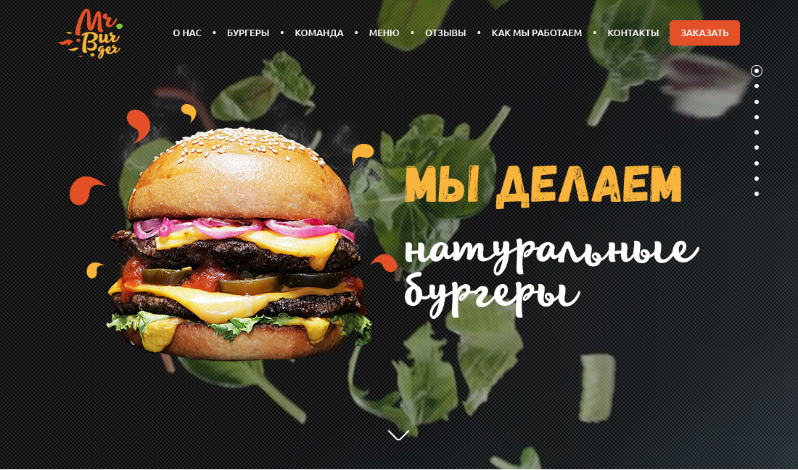

### **Дмитрий Рыбников**
### **LoftSchool Курс Веб-разработка для начинающих**
### **Сайт Ресторана бургеров**

#### FrontEnd
* HTML5
* SASS/SCSS
* JavaScript
* JQuery

#### Workflow
* Gulp
* Git
* npm

## [Посмотреть сайт]()

> Перед установкой зависимостей и запуском проекта убедитесь, что у вас установлена [последняя версия Node.js & NPM](https://nodejs.org/en/download/current/)

$ git clone 
$ cd burger_project
$ npm i
$ npm run gulp